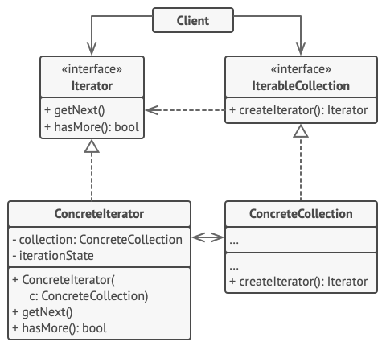
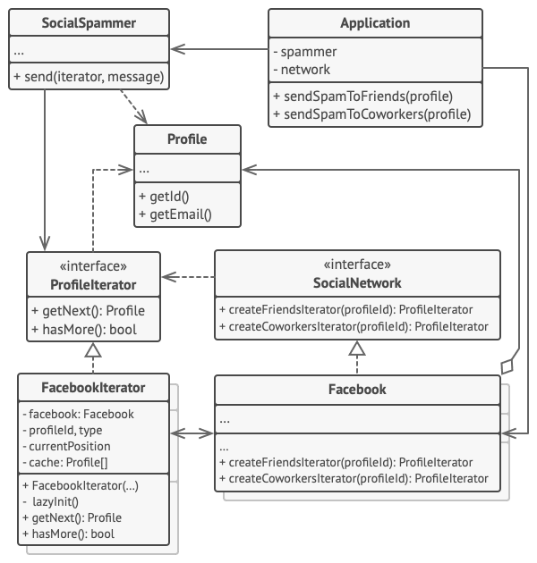

# Iterator Design Pattern

## Definition

Iterator is a behavioral design pattern that lets you traverse elements of a collection without exposing its underlying representation (list, stack, tree, etc.).

## Example
### Message spamming program for services mocking LinkedIn and Facebook

This program implements the iterator design pattern from the scratch in order to traverse contacts in social
networks mocks and send personalized messages about whatever topic. We do not user Iterable or Iterator interfaces, but still
implement hasNext(), getNext() methods.

There are two main interfaces: ProfileInterator (like Iterator interface) and Social Network (mocking a class with inner collection,
 that has a role of Iterable interface)

This pattern is useful in case of a need to traverse a collection in customized manner.

## Other

- Example is from awesome website [Refactoring Guru](https://refactoring.guru)